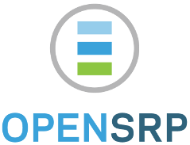

<!-- JITPACK BADGES:START -->
[](https://jitpack.io/#BlueCodeSystems/opensrp-client-core)
[](https://jitpack.io/#BlueCodeSystems/opensrp-client-core/v8.0.4-beta)
[](https://jitpack.io/#BlueCodeSystems/opensrp-client-core/master-SNAPSHOT)
<!-- JITPACK BADGES:END -->

[](https://github.com/opensrp/opensrp-client-core/actions/workflows/ci.yml)
[](https://coveralls.io/github/opensrp/opensrp-client-core?branch=master)
[](https://www.codacy.com/gh/opensrp/opensrp-client-core/dashboard?utm_source=github.com&utm_medium=referral&utm_content=OpenSRP/opensrp-client-core&utm_campaign=Badge_Grade)

# opensrp-client-core
opensrp-core is the core Android library that powers OpenSRP-based mobile clients, providing shared sync, data, and UI infrastructure for implementers.

[](https://smartregister.atlassian.net/wiki/dashboard.action)

## Project Status
- Toolchain: Gradle Wrapper 8.7, Android Gradle Plugin 8.6.0, Kotlin 1.9.24, requires JDK 17.
- Modules: Primary library `opensrp-core`; sample app lives under `sample/`.
- CI: GitHub Actions workflows (`.github/workflows/ci.yml`, `release.yml`).
- Default branch: `master`; latest tag: `v8.0.4-beta` (git).

## Features
- Offline-first sync engine for clients, events, and plans backed by encrypted repositories.
- Shared domain models, repositories, and services for interacting with OpenSRP servers.
- Security helpers covering authentication, credential storage, and audit logging.
- Reusable UI components, form launchers, and utilities for register-style workflows.
- Optional peer-to-peer data exchange with configurable authorization hooks.

## Requirements
- JDK 17+
- Gradle Wrapper (`./gradlew`) with Android Gradle Plugin 8.6.0
- Kotlin 1.9.24
- Android `minSdk` 28, `compileSdk`/`targetSdk` 35
- Android Build Tools 35.0.0

## Install
Groovy DSL:
```groovy
repositories {
  mavenCentral()
}

dependencies {
  implementation 'io.github.bluecodesystems:opensrp-client-core:<version>'
}
```

Kotlin DSL:
```kotlin
repositories {
  mavenCentral()
}

dependencies {
  implementation("io.github.bluecodesystems:opensrp-client-core:<version>")
}
```

Replace `<version>` with the release published on the repository's Releases page (current tag: `v8.0.4-beta`).

## Initialize
Call `CoreLibrary.init` from your `Application` to register sync configuration and optional peer-to-peer settings.

```java
public final class CoreApplication extends Application {
  @Override
  public void onCreate() {
    super.onCreate();

    SyncConfiguration syncConfig = new SampleSyncConfiguration();
    CoreLibrary.init(this, syncConfig);
  }
}
```

```java
public final class SampleSyncConfiguration extends SyncConfiguration {
  @Override
  public int getSyncMaxRetries() { return 3; }

  @Override
  public SyncFilter getSyncFilterParam() { return SyncFilter.PROVIDER; }

  @Override
  public String getSyncFilterValue() { return "demo-provider"; }

  @Override
  public int getUniqueIdSource() { return 1; }

  @Override
  public int getUniqueIdBatchSize() { return 250; }

  @Override
  public int getUniqueIdInitialBatchSize() { return 500; }

  @Override
  public SyncFilter getEncryptionParam() { return SyncFilter.TEAM_ID; }

  @Override
  public boolean updateClientDetailsTable() { return true; }
}
```

## Usage examples
```java
// Access shared services and user/team context
org.smartregister.Context opensrpContext = CoreLibrary.getInstance().context();
AllSharedPreferences prefs = opensrpContext.allSharedPreferences();
String teamId = prefs.fetchDefaultTeamId(prefs.fetchRegisteredANM());
```

```java
// Persist synced clients/events in a batch
JSONArray events = /* build payload */;
JSONArray clients = /* build payload */;
ECSyncHelper syncHelper = ECSyncHelper.getInstance(this);
syncHelper.batchSave(events, clients);
syncHelper.updateLastSyncTimeStamp(System.currentTimeMillis());
```

```java
// Enable peer-to-peer sync with custom authorization
P2POptions options = new P2POptions(true);
options.setBatchSize(50);
options.setAuthorizationService(new MyAuthorizationService());
CoreLibrary.init(this, new SampleSyncConfiguration(), BuildConfig.BUILD_TIMESTAMP, options);
```

Additional APIs live under `org.smartregister.*`; see class-level documentation for services, view fragments, and utilities.

## Sample app
A reference implementation lives in `sample/`.
- Install on a device/emulator: `./gradlew :sample:installDebug`
- Or open the project in Android Studio and run the `sample` configuration.

## Build & test
- Build artifacts: `./gradlew clean assemble`
- JVM tests: `./gradlew test`

## Releases
Check the [Releases](https://github.com/BlueCodeSystems/opensrp-client-core/releases) page for published versions, changelog notes, and upgrade guidance.

## Contributing
Issues and pull requests are welcome. Before opening one:
- Build and test locally with the toolchain versions listed above.
- Run `./gradlew clean assemble test` and ensure checks pass.
- Consult the [OpenSRP developer wiki](https://smartregister.atlassian.net/wiki/dashboard.action) for architecture and setup guides.

## License
Licensed under the [Apache License, Version 2.0](LICENSE).

